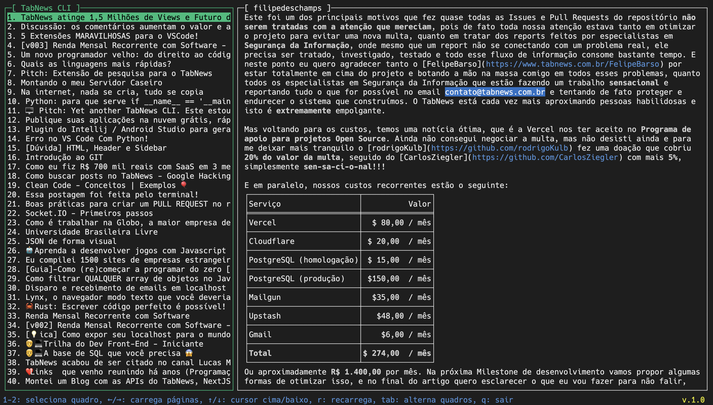

# tn-cli
**TabNews CLI** is a terminal based application (TUI) for the Brazilian news website [TabNews](https://(tabnews.com.br)).

It is made in Go using the libraries:

- [gocui](https://github.com/jroimartin/gocui) for the TUI. This is one the best TUI libraries I've even seen. Supports even mouse interaction!
- [gofeed](https://github.com/mmcdole/gofeed) to read RSS. Easy to use RSS feed reader.
- [GoOse](https://github.com/advancedlogic/GoOse) for HTML content / article extraction.

I created this TUI app inspired by the [lazygit](https://github.com/jesseduffield/lazygit) great Git terminal client, that also uses **gocui**.

## Installation

- Clone the repo or download and extract the zip file.
- Run: `go build` inside the directory to compile and create the executable.
- Run: `./tn-cli`
## Roadmap

The project needs help with these items.

- [x] Main interface created
- [x] Load TabNews **recents** posts RSS feed
- [x] Show feed items on the left side view
- [x] Show content on the right side reader view
- [ ] Fix known bug on the left side list scroll
- [ ] Load TabNews **relevant** posts RSS feed and add a new tab to the left side view.
- [ ] Hide/show left side view for better reading in full screen
- [ ] Show a bottom line with available commands and app version
- [ ] Improve the reader view to show contents better, with `markdown` and links.
- [ ] Add your feature to the list...

## List of commands / key bindings

- **r:** refresh content
- **q / Ctrl+C:** quit
- **arrow up:** scroll up
- **arrow down:** scroll down
- **tab:** toggle selection between list / reader view
## Preview

