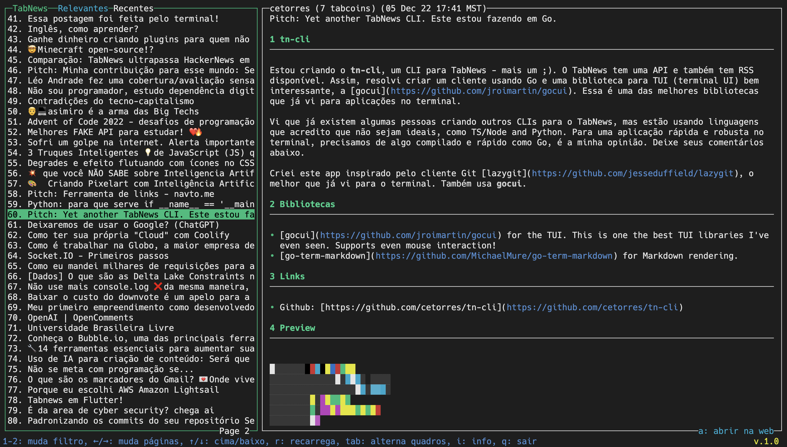

# tn-cli
**TabNews CLI** is a terminal based application (TUI) for the Brazilian news website [TabNews](https://(tabnews.com.br)).

It is made in Go using the libraries:

- [gocui](https://github.com/jroimartin/gocui) for the TUI. This is one the best TUI libraries I've even seen. Supports even mouse interaction!
- [gofeed](https://github.com/mmcdole/gofeed) to read RSS. Easy to use RSS feed reader.
- [GoOse](https://github.com/advancedlogic/GoOse) for HTML content / article extraction.

## Roadmap

The project needs help with these items.

- [x] Main interface created
- [x] Load TabNews recents posts RSS feed
- [x] Show feed items on the left side bar
- [x] Show content on the right
- [ ] Fix known bug on the left side list scroll
- [ ] Hide/show left side bar for better reading in full screen
- [ ] Show a bottom line with available commands and app version
- [ ] Add your feature to the list...

## Preview

